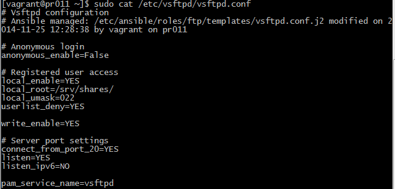
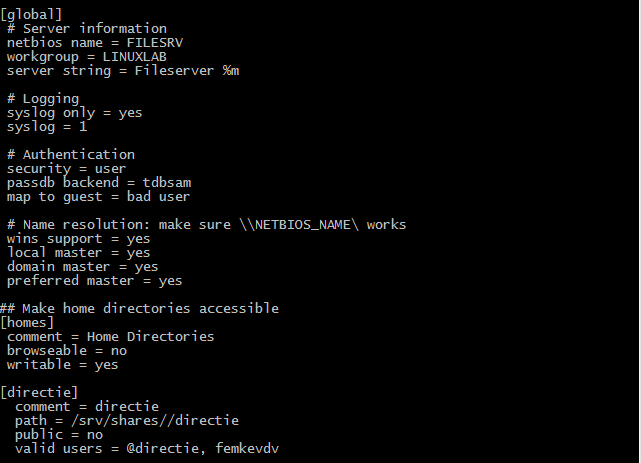

#Samba and FTP

## Thomas Clauwaert 

###Required packages

- `libsemanage-python`
- `samba-common`
- `samba`
- `samba-client`

###Services & firewall & selinux

| Command						| Meaning
| :---							| :---
| `loadkeys be-latin1`			| For Azerty
| `systemctl list-units --type` | List of services
| `systemctl status httpd`		| Services onderzoeken via status
| `firewall-cmd [--permanent]   [--zone=ZONE] –add-service=http`| Firewalld add service
| `rpm -ql dhcp` 				| List of files in package (dhcp)
| `journalctl –f` 				| Log files
| `getsebool -a` 				| List booleans in SELinux
| `testparm`					| Test samba setup 

###Interesting config files

| Path							| Function
| :---							| :---
| `/etc/resolv.conf`			| DNS
| `/etc/sysconfig/network-scripts/ifcfg-enp0s8`| Ip
| `/etc/httpd/conf/httpd.conf`	| Apache
| `/etc/samba/smb.conf`			| Samba
| `/etc/vsftpd/vsftpd.conf`		| FTP

###Troubleshooting Samba

| Samba logs					| Meaning
| :---							| :---
| `smbd -l /var/log/samba` 		| Config logs of samba
| `nmbd -l /var/log/samba` 		| Config logs of samba
| `cat /var/log/samba` 			| Config logs of samba

| Samba service					| Meaning
| :---							| :---
| `Systemctl restart smbd` 		| Restart samba
| `ps –ea | grep smbd` 			| Check the process of samba
| `systemctl list-units --type` | Check running services

| Samba service					| Meaning
| :---							| :---
| `ps ax` 						| Check the deamons (smbd, nmbd)
| `ss -a` 						| Check deamon-port
| `systemctl list-units --type` | Check running services
| `Testparm /usr/local/samba/lib/smb.conf x.y.z.q` | Test the configuration with client ip

## Checklist

| Check		| Task
| :--		| :--
|			| Check Hardware (or Virtualbox-settings) 
|			| IP configuration
|			| Packages (libsemanage-python, samba-common, samba, samba-client) are installed
|			| Services (nmb, smb) are running
|			| Firewall is configured 
|			| Users are created
|			| Samba configuration file is correct
|			| SELinux is configured (booleans: samba_enable_home_dirs, samba_export_all_rw)

## Example config files

